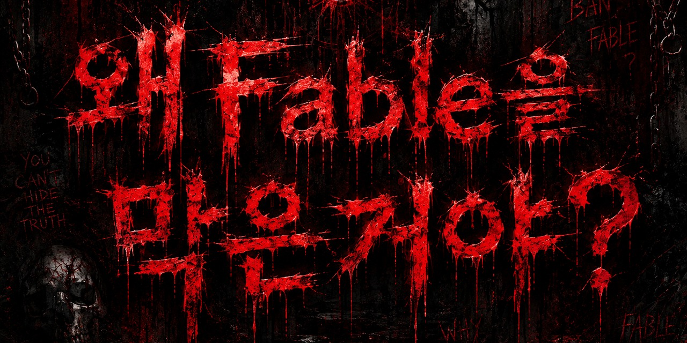
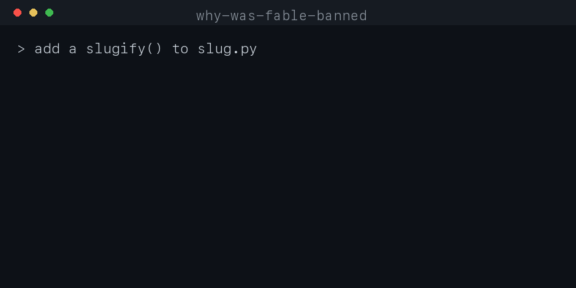

# why-was-fable-banned

**English** · [한국어](README.ko.md)

> Gate for AI coding agents: blocks edits until a spec passes.


[](https://github.com/SihyeonJeon/why-was-fable-banned/actions/workflows/ci.yml)



The agent can't edit code until it writes `.forge/spec.json` and a deterministic
gate accepts it: restated goal, non-goals, context chosen by authority, ≥2 rejected
alternatives with the boundary each breaks, risks, and runnable acceptance. One
shared gate, installed as hooks. Works in **Claude Code** and **Codex**.



> [!NOTE]
> **Honest scope.** It enforces that a spec exists and passes before edits land, and
> that unspeced or forbidden-path work never reaches your repo. It does **not** make
> the model smarter (benchmarked: no capability lift). The value is discipline, an
> auditable decision record per change, and safety.

## Install

```sh
git clone https://github.com/SihyeonJeon/why-was-fable-banned
cd why-was-fable-banned && sh install.sh
```

`python3` only, stdlib. Disable per project: `touch .forge/OFF`. Bypass once:
`FORGE_BYPASS=1`. Remove: `sh install.sh --uninstall`.

## How it works

- **Block**: a `PreToolUse` hook intercepts every edit and exits 2 until the spec passes
- **Spec**: restated goal · non-goals · context by authority · ≥2 rejected alternatives · risks · runnable acceptance · forbidden paths
- **Verify**: "done" isn't done until each acceptance command shows live output (fail closed)
- **Apply**: on headless Codex the worker runs in a throwaway git worktree; only a gate-passing diff reaches your repo

## Quickstart

1. `sh install.sh`: wires the hooks at user level (every project + subagent inherits it)
2. Prompt your agent to do real work: a gated task auto-starts
3. The agent writes `.forge/spec.json` (it's told exactly what to fill); edits stay blocked until it passes
4. It implements, runs the acceptance commands, records evidence, then closes

Grade auto-scales the depth: typos pay almost nothing, auth/payments/migration pay
the full gate.

## Supported agents

- **Claude Code**: native hooks, in-session block (the spec adds to one pass)
- **Codex**: `forge-codex-accept "<goal>" --repo <dir>` (worktree-accept; headless)

## Where the rules came from

Recorded real engineering sessions with hooks (42 traces), extracted them as a
structured decision schema, generalized 19 into 8 decision axes, and cross-checked
the generalization with a second model. Observable artifacts only: no
chain-of-thought, local, secrets masked.

<details>
<summary>Three layers, increasing cost and depth</summary>

| layer | checks | how |
| --- | --- | --- |
| `gates/forge_gate.py` | **form**: fields, real paths, forbidden, fail-closed | deterministic, free |
| `gates/forge_judge.py` | **meaning**: 0–2 rubric, gaming detection | optional LLM judge |
| `bench/` | **correctness**: hidden grader | runs the tests |

</details>

## Benchmarks

Measured in this repo, reproducible (`bash bench/run_quality.sh`, `bash tests/run_all.sh`):

| measure | gate OFF | gate ON |
| --- | --- | --- |
| Code correctness (hidden-grader, edge-case tasks, gpt-5.5 & gpt-5.4-mini) | 10/10 | 10/10 |
| Spec / decision record per change | none | enforced |
| Unspeced or forbidden-path edits reaching the repo | possible | **blocked** |
| Token overhead, in-session (Claude Code) | 1× | ~+spec; LIGHT under 2× |
| Adversarial gate tests (grade-downgrade, hook bypass, malformed spec) | n/a | 23/23 pass |

Read it straight: forcing the procedure did **not** raise correctness on tasks the
model already handles. What changes is the *record*, the *safety boundary*, and the
*token-cheap discipline* in one pass. Details: [bench/BENCHMARK.md](bench/BENCHMARK.md) · [TOKEN_BUDGET.md](TOKEN_BUDGET.md).

## License

PRs welcome. MIT.
